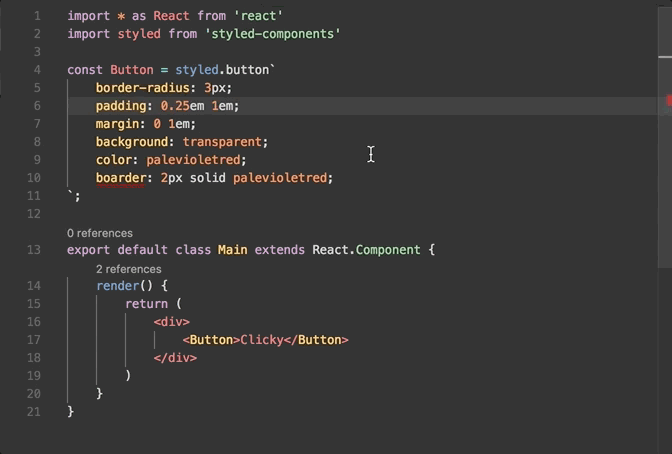

# TypeScript Styled Plugin

Cross-editor TypeScript Server plugin for CSS IntelliSense in [styled-components](https://styled-components.com) template literals.




## Features

- IntelliSense for CSS property names and values.
- Syntax error reporting.
- Quick fixes for misspelled property names.
- Hover information.
- Folding.
- Emmet completions.

## Requirements

- TypeScript 5.0 or newer (6.x recommended) activates the plugin. Below that
  floor the plugin logs a message and leaves the host's `LanguageService`
  untouched instead of activating.
- Node.js 14.21.3 or newer in the tsserver host. The plugin's package root is
  CommonJS, loaded with tsserver's synchronous `require()`.

The automated suite covers the standard Node.js tsserver path. An editor must
use a compatible tsserver host and runtime; successful installation alone does
not prove editor compatibility. See
[docs/tsserver-host.md](docs/tsserver-host.md) for the verified version and
loading details behind these requirements.

Embedding the language service directly through
`@styled/typescript-styled-plugin/api` instead of the tsserver plugin needs
the same Node floor, for both `import()` and `require()`.

## Quick Start

Install the plugin alongside the workspace TypeScript SDK:

```bash
npm install --save-dev @styled/typescript-styled-plugin typescript@^6.0.3
```

```json
{
  "compilerOptions": {
    "plugins": [
      {
        "name": "@styled/typescript-styled-plugin"
      }
    ]
  }
}
```

Configure the editor to use this workspace TypeScript SDK. See the
[usage guide](docs/usage.md) for tag configuration, validation and lint
properties, and Emmet completions.

## Editor Integration

### With VS Code

Install the [VS Code Styled Components extension](https://github.com/styled-components/vscode-styled-components).
It bundles this plugin and works with VS Code's bundled TypeScript version
without installing anything else. The extension depends on `^1.0.0`, so a new
1.x release of this plugin reaches extension users the next time the
extension rebuilds its dependencies; a new major version needs the extension
to widen that range first (docs/tsserver-host.md, "Downstream").

To use a specific plugin version, or a workspace TypeScript version instead of
the one VS Code bundles, complete the [Quick Start](#quick-start), then run
`Select TypeScript Version` in VS Code and choose the workspace version. See
the [VS Code TypeScript documentation](https://code.visualstudio.com/docs/typescript/typescript-compiling#_using-newer-typescript-versions)
for details on managing TypeScript versions. This setup path requires
validation against the specific VS Code and workspace TypeScript versions in
use.

### With Sublime Text

This plugin works with the [Sublime TypeScript plugin](https://github.com/Microsoft/TypeScript-Sublime-Plugin).
Complete the [Quick Start](#quick-start), then point Sublime at the workspace
TypeScript version by setting
[`typescript_tsdk`](https://github.com/Microsoft/TypeScript-Sublime-Plugin#note-using-different-versions-of-typescript):

```json
{
  "typescript_tsdk": "<path to your project>/node_modules/typescript/lib"
}
```

This setup path requires validation against the Sublime TypeScript plugin and
its bundled Node runtime; that runtime must meet the requirements above.

### With Neovim

Neovim talks to tsserver through a language server that wraps it. Two of them
load tsserver plugins without a `plugins` entry in `tsconfig.json`: install
the plugin globally, then point the server at npm's global folder, which
`npm root -g` prints.

```bash
npm install --global @styled/typescript-styled-plugin
npm root -g
```

With [vtsls](https://github.com/yioneko/vtsls) and
[nvim-lspconfig](https://github.com/neovim/nvim-lspconfig), list the plugin in
`vtsls.tsserver.globalPlugins`, with `location` set to that folder:

```lua
vim.lsp.config('vtsls', {
  settings = {
    vtsls = {
      tsserver = {
        globalPlugins = {
          {
            name = '@styled/typescript-styled-plugin',
            location = '/usr/local/lib/node_modules', -- the output of `npm root -g`
            enableForWorkspaceTypeScriptVersions = true,
          },
        },
      },
    },
  },
})
vim.lsp.enable('vtsls')
```

With [typescript-tools.nvim](https://github.com/pmizio/typescript-tools.nvim),
list the plugin in `tsserver_plugins`; it finds npm's global folder on its
own:

```lua
require('typescript-tools').setup({
  settings = {
    tsserver_plugins = { '@styled/typescript-styled-plugin' },
  },
})
```

To change [plugin settings](docs/usage.md), add the plugin's entry to
`compilerOptions.plugins` in `tsconfig.json` as in the
[Quick Start](#quick-start); tsserver still finds the globally installed copy.
To use a copy installed in the project instead, complete the Quick Start and
have the server use the workspace TypeScript version (for vtsls, set
`vtsls.autoUseWorkspaceTsdk` to `true`). The tsserver host must meet the
requirements above.

### With Visual Studio

This setup path requires validation against the installed Visual Studio
TypeScript Server host and runtime. Complete the [Quick Start](#quick-start) in
the project, then confirm Visual Studio loads the workspace TypeScript SDK. Its
tsserver host must meet the requirements above. Visual Studio does not support
`jsconfig.json` projects; use `tsconfig.json`.

## Maintainers

See the [maintenance guide](docs/maintenance.md) for local setup, scripts,
testing, performance baselines, package validation, and pull request guidance.

## Credits

Originally forked from [Quramy/ts-graphql-plugin](https://github.com/Quramy/ts-graphql-plugin).
